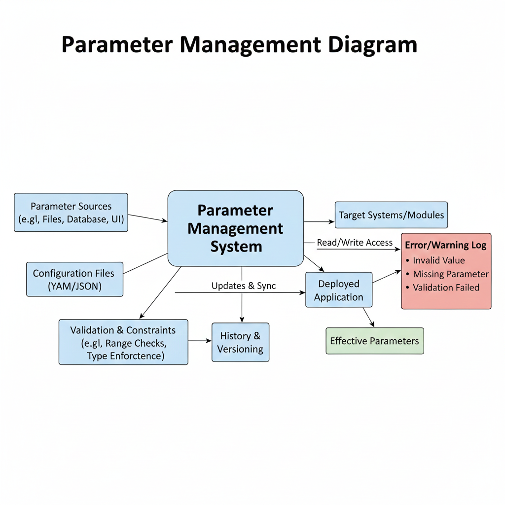

# Parameter Management with YAML

## Learning Objectives
- Use YAML files for parameter configuration
- Manage robot parameters in ROS 2 systems
- Implement dynamic parameter updates

## Content
[Content about parameter management with YAML will be added here]

## Key Concepts
[Key concepts for this topic will be added here]

## Diagrams

## References
[APA citations will be added here]

## Assessment
[Assessment questions will be added here]