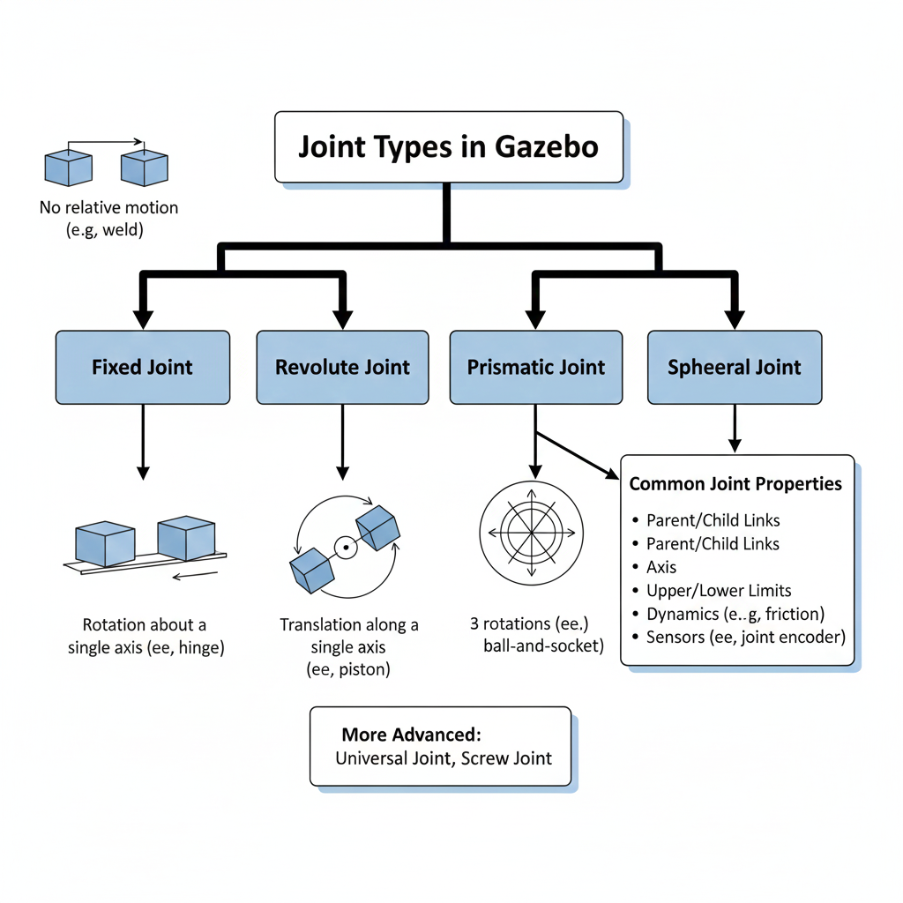
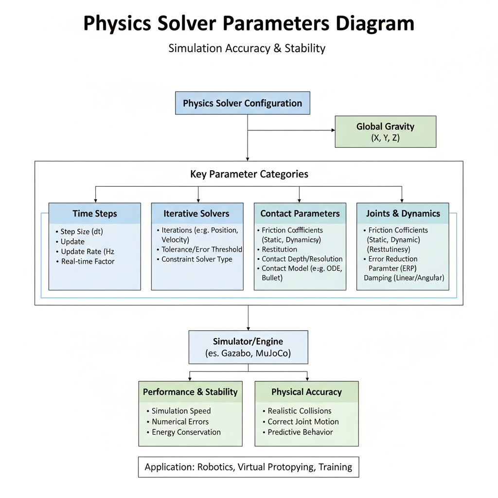
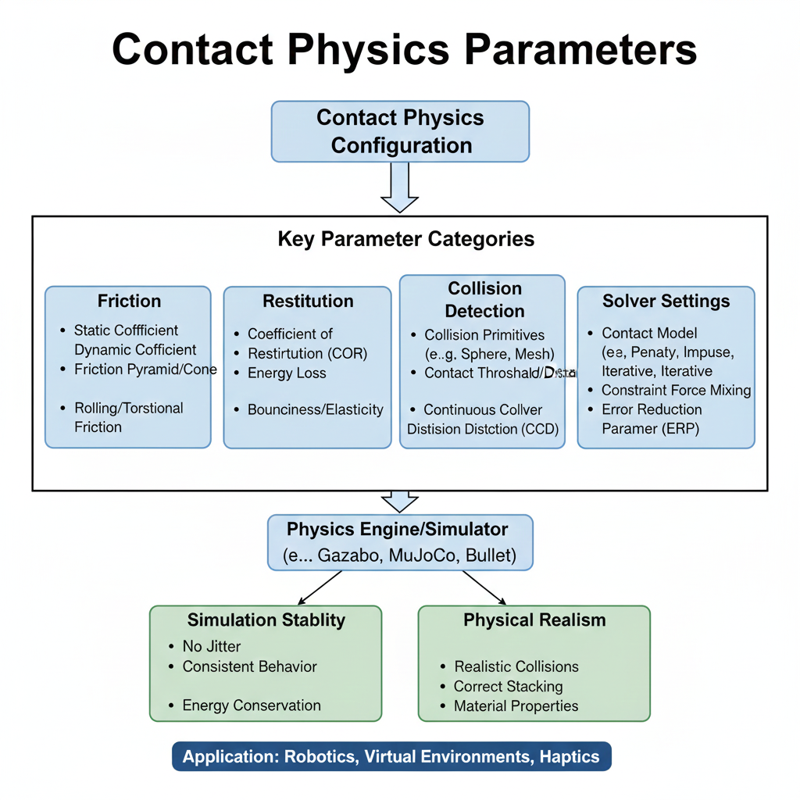

# Gravity, Rigid Body Dynamics, and Constraints

## Overview

Understanding gravity, rigid body dynamics, and constraints is fundamental to creating realistic physics-based digital twins in Gazebo. These concepts form the foundation of how objects move, interact, and behave in the simulated environment. Properly configuring these elements is essential for achieving sim-to-real transfer, especially for humanoid robots where balance and contact dynamics are critical.

## Gravity Configuration

### Understanding Gravity in Gazebo

Gravity is a fundamental force in Gazebo that affects all objects in the simulation. By default, Gazebo uses Earth's gravitational acceleration of 9.8 m/s² in the negative Z direction, but this can be customized for different scenarios.

### Setting Global Gravity

Global gravity is defined in the world file:

```xml
<sdf version="1.7">
  <world name="my_world">
    <physics type="ode">
      <gravity>0 0 -9.8</gravity>
    </physics>

    <!-- Rest of world definition -->
  </world>
</sdf>
```

The gravity vector is specified as `<x> <y> <z>` in units of m/s². Common configurations include:

- **Earth gravity**: `0 0 -9.8` (standard)
- **Moon gravity**: `0 0 -1.62` (approximately 1/6 of Earth)
- **Zero gravity**: `0 0 0` (for space simulation)
- **Custom gravity**: Any vector for specialized scenarios

### Custom Gravity Scenarios

For robotics research involving different planetary bodies or specialized applications, gravity can be adjusted:

```xml
<!-- Mars gravity -->
<gravity>0 0 -3.71</gravity>

<!-- Variable gravity for experimental purposes -->
<gravity>0.1 -0.2 -8.5</gravity>
```

## Rigid Body Dynamics

### Rigid Body Properties

In Gazebo, objects are modeled as rigid bodies with specific physical properties:

![Rigid Body Properties](data:image/png;base64,iVBORw0KGgoAAAANSUhEUgAAAQMAAADCCAMAAAB6zFdcAAABI1BMVEX///////0AAAD9AAD8/Pz5+fn09PTv7+/29vbr6+vk5OTn5+fg4ODu7u7Ozs7S0tLY2NhOTk7ExMSHh4d4eHhVVVVsbGyenp5hYWFycnLHx8dlZWW+vr60tLRERESlpaWYmJh+fn6Pj4+tra0zMzOampqQkJAAAPw7OztQUFBISEg/Pz8mJib+ycj+dHP+t7UkJCQaGhoRERH+iYf+JyP92tvy8/3Q0P1ycvuenvu8vfvv7/3e3/xRUfyUlvxoavv96Oj+hIT7VVOnqPyvsPlbXvyCgvtGR/09O/zb3PzV1PuGiPy4uPzKy/4UFPqLjPv+mJr+aGf9vLz+PTj7pKT8XFv8RUX9Gxj93979Ly/7PT37TEozMftXWfoiJftxcP1IS/ot/LS5AAAbcUlEQVR4nO1diV/bRhZ+snVblmTdpyVZvk1aIFuDsTFpDOYIhKZtmuw21///V+x7MhBISBq26aZJ9f1AHkkzo3nfvBnNm0sAJUqUKFGiRIkSJUp8MTDvnLNfJBVfAs9/vH///k/fc+h8+OSt2M8f3l85fvjx+4tf8vfze8Tc+/Hn/0s6/0rcq67wAKBa5a4u/1D9ZeX4ufqk+P1+5e3Zg3fCf1/98f+Szr8S96rfPXjw/GH1VwCuoOBBUSYYjru6X/x+X32C/p5UC/XgHlyF/756//+a3r8C94p8LCR59gsHz/9Vrf5afQbPn2H2//B79cn3Vxx8d3kUn6JC/Ephf6t+92v1/r3qQ7ipRV8ZMJ9/+OHev6v3SAqWrZJU1X9hWfgdHlSrTx5Wrzj47aeffqxWnwP8q/rwfrX6EzzH+79Xkb1nWJIu9eVrxEV9QApdreLZL3RpxcF9UpEnVxwUeMqhC7Md+YHvkAd4ikHvo1Z8Ryx+pUBF/v7hqkyjWL+S2MwFB0+rP1OdeMnBU9SX75CjH4ty8Kz6/HcSm0rRc2QFA3+1KOqD36r0AkQxivL+4HYO6JepVsUVB/gmeXjJAfyneu9rfj0UiceSLRb1wXN6Sf54VRZQ7O/ecsCJD7BEMD9X/80gNc/Q3/1VWUD1eVb94QsL8iewysBCUuQAHVgjvq0TH/5WvVkfVJ8C/FJ9hpfvEXMP/1Ol8Ojz2ZcV40/hh4ek2Q+ePnywaif++uQ+hxw8f3q/eDc+vff7T4W/e0++QxSNRuanf2HlAMW78cm93yj80+pPX06Ez4wHT++zmKv/uWMw9tnX2zh4DxyWhCerBtCng/3PXUP8vfH8yS//fvj9HQM9+f2uIUqUKFGiRIkSJUqU+GsgfekE/A0gm8q1M6V+4QiKI6/jQZDRlNGvB/kQb4r4sSdJ8m1hRf02v+9Do4P6RyEj+dNiezdYLRauTob+hcMtjkKMh6CLz2tcC+HGH4jK/2gKFJIgid65KjmflEq2Scfk7QXNEN9Phj74aC58EKIKunEx7KUnNtnueRZ3QPfMlM8hcUzkQ2xmGQeJlwG0fD9u4Q/6U7ywJoVeAq5rUz5lLSeAuuNRBrGWHYPrmRAkngsa+lQCMH3LYH07ANcPdM8RIHZSCz0bnqdBFz2jxW0VPxDbGcWvcB3HijCqRsuXwOVcx2dZ8uLZEiZuFX9BTY6Jy0b46FroJbcJ+jH4tu1dKJklRDn9xLABaxD0a76WgY8ccBVOczQf4m6ewDCwhRplX5uTslyGNvQDPCAHHRgKdg365DYgNCzIO7kFntTn6kaQJDn69DUYgq1yfeDtmgcmceAjyZINOSqkEYGFqVHwzFhnxb5QAdeBJreh8PgcrgKRq0Vgqq5bWyUowfhR//QQjEylnHFr0BQ+JOzt0CuV9HL0s+J7lH5LhjUBhfRqVqqBnqIeYBkZuBGwA78GcRQkHSRc8tBvzfIrJDQVFouHPF+zrAbWKjYP0A0wQB5BS9WHnhwkIWa8MfR9WwlFadOyBnEMdSp9geM0oTUkBRBNv42VUYxZyYeYBN0D9OXRs0bQFENQMlSnURDHkpUEyCOWLhOVMMGS0da6qxSt37GmX/evSItaLEuKjOV6HfVAGNasOMesxJS1gW8YLdAyfJ6Jmknis33gTBv5Ig6GlPca+HpzVWxDGay8C2qWx5jGBGp9Ncl0yAIkJ2Y9nkd/edCCwCctA64tqNBCJbRQD5ADNUON2ADo11AhkIP6CHMIRsiBbpoRalkeS35ggmZdcBBg0QkLDjZ4GN2NA/VaXYt5DJgsMGUUKbZDW8rAK0oXNwwbOjjesM4PwoEBraLOzO2Bkod+qNuYYXjeDbFMBkMPFQfkIVYDodfgUQ9SPbftWM35RmgHShM9OTy4diMCJ/RIfUPLsnnbGWJuBLZvEYd+aLPxcBCLDuod+ILnDCKwRQuUrk5elA05o/iFxIAuVUC+15RUSlbi+J52Nz34ELpYudDv9VkC7OXB5q7Ob8wiYK+FuHGTZW+9f+nmrg43L30A7HuOdy5+pjkfqAf1D90z333DlShRokSJEiW+SYif1r6s3Rb0fUv+IrbrfRMg3TRsWfLCF20Q9lqsrMzeYoLLt8XwHpjZzcbRu9Nl/wiG+Unehrc0wdrvNpkCWc8LR+X61fwmVTI1r7UiKNqMV5AGhS12Azm0imajdaMNzABDf8U/Q/IyzHzKXEhO13amnyTStXR3IUEzWUm60MligTMzyiLN8FW0cTAVUdpS/Ai8uFWHemZyXIJmIvBmJiibBupHbqHYHT8HNGvtrqBDhL43QLGwDd/1KfG6oBq+XogkxWDooetCTYHcD3jPLUx+OctkwSu6VWIXn69bWZ3NrbgtqyBkJotGV2opoPkdzInZYskstreYs/3t2XLCcOfbO8wZh2ck+fjR9hl3NLmjIgSp1gIziDwhTWqVmqdJA7xqWnyTHXIoTEVL2vyQayTKCK05xYOKjgkZ6fKIa6NWq20xzaMEQsXNJCdWW6rPezU0KcW4kyQcWcimZnWFEUuOeBMGckVxc8ONTL6ho5NIsOu1objioG1IbRiKaDpXFH3I2VxTCTJTMWOxidqVoKW39Wa6mHMH493FcW+2PFvsMIfjl+MXp7MjVIrzM3jBvty5KwddiLNmhGKMOMjkSmahEUpmqS+ghdRG+xg5slB28IN1y2qvutfaaDGKaNdi7kPdgzxr6y6atrqatijr19S+5XvCIKTsb2mYhx7ypXdN5ANF1c0g8fGC4IFMfSm1ln/JAT7HUpSWY4MNvAcePRjjbfpWX+k2XGRy65zZ29s+PNvlmENmsWAmy1fTg/Ehy/SQA26yfMxuz+5GAepBnoJLHAzr4Mhou8fcJQc82e4FBzLyMVCadLPgAAv8iKV+F9VEtW/lkGnEgaKmrgGRtKZbwEe6KLZr1ziAoa+OgtqKA1OHWA8xMMUmcs0LDhoiNJQ2W28gG0iRJ+HjclNp1DFWFblGDubM3gmzNV1xcPryhDkgDsYFB4cnzCH7+q4cGC3Vbg26kQv6KKvIuW2R/mYqPt5oOJuwRmI6SiO0MjCdsMuR5JDYjokFBSuODWsoxKE5yjsRuA3N5PutIVJkm0ND63ebRRFwFGgQB1bKVjisE7XMSGt90+ZtUEjwfuqvy6s6cWB7LrQ7TptH4Sv6gDWtQZDpwdAcwMi0sSo9e8QcH50fMUcc84JZ7M+Xyxdbu+MXKw6Wy+Wrk/nBHTmA4kVFtX4kgi0Cf+1dyV9/J9H1+lXfE3/hUlM61vmV6V7U4qv3WQ3d3Mc6nK+/GN/6a4jXzylSadXJQL5lusnQK2DGXGE6ZtiLtwTemHJ49r9P7tKatnv3QHcP8lGE/1sveYkSJUqUKPH58W4Tm2Fu//2At7s8qbD3/o5YzPevNzGZxcoAPdnZOSkc3O3Jnu3dvUHCnpy+cyW9ahWI0FpZ6fFVH0SUfSQuMb10Je5Hx2c+BoaaVvjzgp3SekQRm1oMjQ8tj+meuDMfjxn626MWGV4ZixQEM3IsUrDlGcOOiwssHkS6hjGgSMyYY1Ye6UIRkgWGxQuPZjsTeiS6geOKEF7RIuWxtdmAJvCUrpZGlzhsjm6IwOIPy4kg8ivBqZFK1/BC0QUh8GTCJAG6WEw7f0cOxkfzw2MGtnqL+WzvZGfJ7C53udmbvVczTPHu66PF/tZi++X+5PHJcntvwhxtvzlhXm4fjSd7B2iisq/2Zq92xcNHb7jJwd7ewSExt9zePZu92T6ccofLl5ir3NH54fHZm+Uhc3y43Ju+2tt6sbfLTdHNLI/2iYPQDjuQOl4cVQzP82gINR36DqgNvytXurWm6UFrmEd2SKZ2bpsOeI6XgxnaZGSYvt/RKknf5hyrIalrnza/4y2ms/FkQRYXszzhDt8wi/l4sTgYM7vIweSUmSwWZwc74ynqwRY7fcE8ZqbbOwvm+PjFFM9Q3tn0JVntO5P5DlotW4+weBwwzIvZS+ZsMlmM5wuk+Xi8mO88YiZnB1M4PzufnS2Zxc72znj75PVxUcRsGWwFjaQ+N0CzsZjU0KWx+4YuNNk2mmxo2aIpuykJbdRVjRP67BoHG/WQJizQXB1liIFcTfV5w9I+rWfsOge750vi4Ag5YHa30fKaT05eMcwcc3S5BVuTxQ6z2J0jB9vb+0fMIcxeT3ZQu19N5hgMtmez17B9AsfL+RY8BuLgZImxzZZo5BZx0SMeLSdI3OJsl4X9/UezswksTnfn88nswtQPMS/jYuZDAxos0ASclgxR0nZTl1sDW4A4R2O7QqdY8r2kT4b7utYFlgaIMz9pIAepFnudjqF270gBs5gw2xPk4AWzPF5Mlmdn28x8Z3nGPUY9wLzbm0zOXqJdyh5Oj5izHhxhLXi8x7w+eyGiAhQc7MEpUrdzvgW9goPxY+5kd7aNHJw+Yh7tAJyeM8v5zgImZ+cL5nCGz5gDGr0LZm+6N5NoEsAgQht9Q6qtoSRobpN53mrBUApVGKKJ3u3AQMl06Nc46tesgFBh2yzQJJCYujMqoK7DOnRyeQBRWsxKuRPYR9tnpAcTZmd6zrDnzGJvwbDLbXovkPtsazbdfj1jzk9O9/Yn7ASm+8z+3j4ze1104J1Op/uFP2ZnBnNmhiIzx3tLbnoKsx1mske6wpzjI47PYOuYme/toMrM0L2F7lNmfypTd0WeoLrXfKsOiZGwxcwwI3cM4DJHgxQrByeCSALB8ultoTtpLLss3tCchDpxIyd32Q5IFhhOCxTjrhysKu7VS3vlvOigvbh86Sys8+IAl65Lb5c9vXB16W3X78VtuOl/FUPhsXZj4l2JEiVKlChR4m+Ilfkp3GqF3hx6/uAMvq8edjHykSi33FLCG6f9b2gkIMpc0ONMxdZpJkOoqsBFOq8algKiWaw74FKaSgyKD7FlgJiiX64TN74dDhQL0ihxOE8OXaENoTJCe83Una4wgqFu0GwKNy5mxSuWYYmO2g3YdbC1qPLtbFcAkTmMXRUC1+chVR3BkkLW1H0ZBjW0zcmMZZNsQ0YOskwB3QQ3q7BrQGOT3wriDG1zVPk4dySwFEfSLQsKDhqoFmjSorQBeApx0FIhcm0V+uwGsvPtcKAN3IGZt7MBOLbvU524rkKmhwqMODd0aHzdNM01rBAUR1xP10Srm20oru9XoPGJ67L+/hBkrOEC/qJjU2LBprdgMRE+Elnq1gKFB7zF4duQpFZEPKvxq+H1bwfUIwtWMaWAG7016F3PLq37EiVKlChRokSJEiVKlPhyYN6O8P6Rz88+ketqyo4eqGpQJ5uY+0B3QG01RZ2Wr8iX89Y/0yJ7gNlZMao9PvlDn+PT9zmo/al0GPmFOHE6dLoydRsK+e1e09XSrT7SZlz2N3du88he348k/cjDp4+unKcHhWRnvfHH07sczx6/z0H7z+WFoQQX4wVpALDuWoIYgRnSpjNq7gWmL0IepihtZhmQhVqxskCryY5DiwtyyE1L83JIur4MSmgJXDfM24ruODrEps9FG6hVrOl0YBWC25scnm6/HLPLo9fs61ez8d7RDrPcXh5PmMnRyxlxwOycb7+cTrdfno33DhfM/vxgb4w3HzE7yzenvf3pkjne3T1mFoe7NIGn5jiSVqHsSUMT1NiLab+au60kqGm1ZMVi1wCoaLoneEYLTCQmzaCiG13NBzfJE76tWio0Cg5SzVNqlNttqCjxCGx+qIptdk1UmuympNiszwkNqEhqJtEKligGX2nIFILrzRe9kzfzk+1x7/Tg8dbBo1lv/Orlyf4RezDd2zshDia9rdeH095k/GL7rHc27x2/eb3zeHq4mPR2Tnvz4x7TO93pzXpb+zS9sS8J6xzN0NJTcOPEx7QMVlvWfDqCSqXLXXGwCVyT98Bpkh6kBqxBzXIDEJBsSII1xxnVaA+iVNUaIZWHEQxBp7VeIW2nY9HYjA1CCLrlDGEAnM3S6jg2dfqa3ghJD3ozFGK5ZJeHvf3TN0zvaLd39uoMFoeY1S8uODhiTnroi+1NmdfL+Taz82r5ePfV9uQ1M+6xx71p7/BNb7rde3Gy2pjGkWlVGST+MC92R4nyzt3KRuVqT5gLDoZ8qEsw0AsO1kG2Yhe0zFLADPocreUqOIih3r7gYLXWi4cmJWVNHNC+TxXk8i0HVgSZFoNYIQ6Oj3uwfHR+wLza3z/EAzPnHm8hB1s95tHBhR4w+5jPwPT2mVeL+QtmfjQ5ZPZP5ksY98akB7PpZDpHfxgfpmKdIw5cF/KCA1TW8MPy3oL4LWOtiGZ2iSPBE9ayJleQsonFGJp+W5BGzpqht52wqBNTNW8UMyjbtN7NRE337EYOaaMZi0OMJbAzfw1Lg9iATYw1si07wRCtgoMT5GB50nt8hMXg/KTXO2B6yMER1+u9ebVVcPC41zud9hhmh27OX/R6W+xRrzedLxl4QQqy6PXmdGWOKcibDbeYyKg3s5DGwzIVzM+ysOjmmEFRVt4u1lrh5sirDTdxW1czhbhclguFezVN63Li1+X8LCwLlxPDEI9eX5vWBVchGObDrQnnrpN0Pw/Mz9e/zpxuXxOOWczv2ibyP7Sh21eEmy3Bv+n8/hIlSpQo8e1Dv24xdy7XotchvVr/Tm1q/ZNbYEEE1+asvbMXysVcr8KyebtSK1LdWuvGFpjFWiUfbgF76a9+51UKH4aa0kQ8TmFpqX+mc6vulQo4CpEgo7lDzWdOgvoq/RL9KJiSmkxeWZFlFVYke1rBgGw9SorgUC/W77dUikUognJirS5CvcbR0n6JpcUXPHAs8AJnKbRHBMtSdw0lpViV0C62G1BqlCBWBKnIH9rYttjHVwqLBV4f39P3E6Ftmo2a1HeboupZFb1fWGRBJc6GmQOO2cr0CuqA1tK8lNrFSeg2wHYbam5lJhpJamq0075jJYD3dXFormHyjUoUhS0yYDqjlg2BnVLOR+tpV1dts8K3wbQ8snfWwceAsZHJIcqrbHQHitR0+/ywgfINPcuEYernSQyukfhZSptaDrmmO6QdTSuZjVZSp/G/bSt8A2oGimXqECW2iBZwKLg0H2MDaA9YVhG0NpAFqLUih/IZ5LqyDu1IArMlczUf1E6Ugi1BU/HkIMSwSVIERwktvViZlUQjTR6gJkQdMBVbgAbfRiUQacGOL3mWluSXHHigui0NjDSmAoVG2ggUKXLQRm1wbUXepDwI4gQETBJtEtI3LDm+tcjckQMX1SpTMEMHLJhykBS7FG3S5qo2eGbUL7aNRRtRNynnUidqoyWNxqJqhVLBQQ4ezw4DJ461TIdgxQFK2EIyuwpE+XoUR6jkWEpMHR+S8W3aUZa0Kkpdy5KuOLAwNZgUzSw4QKOwwTbSHNVRNbl2FBtYKFEhItrRFfDZsBZbcfwZujbVdb6VRw5na1lUqyiwltLVCu8oMOQqqNbQVogDN4E1FKQvKBV+QzQsKxA3oSKEHRTN5tk+1xZzU7XEQVEfiH4ubZAZ7ogNOcu5tlDsmZvpZiJXRNSkekyzvdiKlqxBYmRFfaD7EKRGKHoq7eRMU+KatSG4A1ArMjT1GoVwu9Ia3+pQWajFmTxkO7d2bd4NkmFiCY4sA/O4hdnlFFVPEAUCRKD5USQGWA1JAbjFblW1LFEVOeuybDeTQbdUTcFyhJoBSubSTD+D3gRGBJ2MCqpmUCjKXMxmHbCGzBOby0HKiqyGmJMM0GVDiLCgCQatbqKk8F2s6mL6iyw9oe5LEFsmlUW+hQ+lGlOMuii9Zn2gI/jPwLU+f5zXYaZR4499fVmof/XniNXon/PB4xIlSpQo8c2gsHffW9GkXL3TxD8wU1b2svJOrzv/3pasgajctm6KwNHadeFTJozX7vjdiU8Dm9Kx/+7l5tspC7e2o972MGwUx+TGgEcgv7ctgTrgN9+yGdygw6cW99ofc5BA9DkWUUQejY9bEhdnGbBmaGAbWffzQXFDTzPoegHwmTvkadqBEkOuhWaHdqOIwYiLz5mwWagqm5EhQ86jz7YSgIAWTpx7Cshh6tK3ZdCWyBJaDhCtHuqC43T7Gu87EuihKTQyMMPoIjJhPaUvhdBkgABy05AwfdDCdKhhRh0GcWjxEHuJvBHrtSDGG4K/GmhrUfrpuXeBYkMatIXaSKwIUSdH244dcn02teUQktgI2TRHm8hWtAo+PFPcPtjKJo/WbQstIKvDUg9LJ8dQo7pJG0+ST7YNbuDwzZi+pSLQdzXAirQ10QziFGh7Wd3DuONECWEgi0NY54xOFuUu0E4mvgGjuk1CbEIWsUMhjLi+pJmdGG30NgRYSkQ0ME20tFvGUE4DNF6amCiF5pGYMQwkO+aHd+Igz2k+A30BxQbF5+xhADbtKGLHo9A2AxcaXthX12iZCxnaWaZ2lQwCN7PDRp6tNgkV7EYAA9qA1FGGtA4sFGxwxCYav3VvVaxautYFI/ftkIb3E4wbhRYcqIThhpYVHkRvSLUAPioxim9AbNKKsiRyBJZEGoXhSI3bhR5Evp0l5HkAqYoGe0hbw9BjMEfiOOShcachwCjFJjwGb0vIgaXx9CkULPB1O3KxUjJc8GqgCpuYBirfI9No63oGhttVQZEthfpPsHJDY3hAo99DuUlpV/0WhAUHfB+K9UCmghxEOaZXVwozuq5Ged2hToIcnyzFXV0TYKQUXSeWXmy/ukmRZ1ooIC+i6wkQ1CIIkFSVJjqgzW5gvhUceKggxabOdg3MAAPcjQNoZEPWte2ENje15HZmcw0Is4GNN/oyEqH0s+IrLevEgZPzFaoTjVTsZ33uggMdQ4HtSm2nXc89DxODBn9In58ZYrURUgbFjQA5SIR2NqLkDbN+LSYOcjtsge8P5XiotM0BS5FZXhErClW4vTp0woGqtLMG+rRRjYSm6djQxHOn2wmIg7rRcIgDpW01wLszB0XPpchdP7voGJaue3jf2pPecbOrofvi/2rLbDan7XHh7ZC99E5gjvwLKw8XF6+/7S7cPHsR5mIl9lX6LqNN2GIZ4t9nGTbXftsWSDz7M/R6/iEi2/5s8wVLlChRokSJEnWwrrV/ro/eyZ9hCOerADeEfvElGbloYfWL1lfxCVpJsWjF/ze1wP92JBWt4TkpmFlhvbcdpwOO6aGhmo1avgLhP+AryGghtUWosGuyTuPKbRaGeogWLFqMaI203puM+y1CbMCIhQ1plOc01RVtPS9Ae36EZzUL+tE/4ZONNBDOoZm6zutk320YtT67LgX07d3MAncTguBLJ/GvR67FLCRQy1pFT11uCuRmIbCiAPQMtH+4PaYP/pKe668KH+z/L1GiRIkSJUqUKFGiRIkSJUqUKFGiRIkSJUqUKFGiRIkSJUqUKPHPxH8BaEfi4oWoD88AAAAASUVORK5CYII=)

*Figure 1.4: Key rigid body properties including mass, center of mass, and moments of inertia.*

#### Mass
Mass determines how objects respond to forces. It should be set realistically:
- Humanoid torso: 10-20 kg
- Humanoid limb: 1-5 kg
- Small mobile robot: 1-10 kg
- Large industrial robot: 50-500 kg

#### Center of Mass
The center of mass affects how objects rotate when forces are applied. For symmetric objects, it's typically at the geometric center. For complex shapes, it should be calculated or estimated accurately.

#### Moments of Inertia
Moments of inertia describe how mass is distributed in an object. They significantly affect rotational dynamics:

- `ixx`, `iyy`, `izz`: Principal moments of inertia
- `ixy`, `ixz`, `iyz`: Products of inertia (often negligible for symmetric objects)

For a solid sphere of mass `m` and radius `r`:
```
ixx = iyy = izz = (2/5) * m * r²
```

For a solid cylinder of mass `m`, radius `r`, and height `h`:
```
ixx = iyy = (1/12) * m * (3*r² + h²)
izz = (1/2) * m * r²
```

### Inertial Properties in URDF/SDF

In URDF format:
```xml
<link name="link_name">
  <inertial>
    <mass value="1.0"/>
    <origin xyz="0 0 0" rpy="0 0 0"/>
    <inertia ixx="0.01" ixy="0" ixz="0" iyy="0.01" iyz="0" izz="0.01"/>
  </inertial>
</link>
```

In SDF format:
```xml
<link name="link_name">
  <inertial>
    <mass>1.0</mass>
    <inertia>
      <ixx>0.01</ixx>
      <ixy>0</ixy>
      <ixz>0</ixz>
      <iyy>0.01</iyy>
      <iyz>0</iyz>
      <izz>0.01</izz>
    </inertia>
  </inertial>
</link>
```

## Constraints and Joints

### Joint Types

Gazebo supports several joint types for connecting rigid bodies:



*Figure 1.5: Different joint types available in Gazebo showing degrees of freedom and use cases.*

#### Fixed Joint
- **DOF**: 0 (no movement)
- **Use case**: Connecting two links that should move as one
```xml
<joint name="fixed_joint" type="fixed">
  <parent>parent_link</parent>
  <child>child_link</child>
</joint>
```

#### Revolute Joint
- **DOF**: 1 (rotation around axis)
- **Use case**: Rotating joints like elbow, knee, shoulder
```xml
<joint name="revolute_joint" type="revolute">
  <parent>upper_arm</parent>
  <child>lower_arm</child>
  <axis>
    <xyz>0 1 0</xyz>
    <limit>
      <lower>-1.57</lower>
      <upper>1.57</upper>
      <effort>100</effort>
      <velocity>1</velocity>
    </limit>
  </axis>
</joint>
```

#### Continuous Joint
- **DOF**: 1 (continuous rotation)
- **Use case**: Wheels, rotating sensors
```xml
<joint name="continuous_joint" type="continuous">
  <parent>base</parent>
  <child>wheel</child>
  <axis>
    <xyz>0 1 0</xyz>
  </axis>
</joint>
```

#### Prismatic Joint
- **DOF**: 1 (linear motion)
- **Use case**: Sliding mechanisms
```xml
<joint name="prismatic_joint" type="prismatic">
  <parent>base</parent>
  <child>slider</child>
  <axis>
    <xyz>1 0 0</xyz>
    <limit>
      <lower>0</lower>
      <upper>0.5</upper>
      <effort>100</effort>
      <velocity>0.5</velocity>
    </limit>
  </axis>
</joint>
```

#### Floating Joint
- **DOF**: 6 (free movement in all directions)
- **Use case**: Objects that are not constrained
```xml
<joint name="floating_joint" type="floating">
  <parent>world</parent>
  <child>floating_object</child>
</joint>
```

### Joint Limits and Dynamics

#### Joint Limits
Joint limits prevent damage to physical robots and ensure realistic motion:

```xml
<limit>
  <lower>-1.57</lower>  <!-- Lower limit in radians -->
  <upper>1.57</upper>   <!-- Upper limit in radians -->
  <effort>100</effort>  <!-- Maximum torque (N-m) -->
  <velocity>1</velocity> <!-- Maximum velocity (rad/s) -->
</limit>
```

#### Joint Dynamics
Damping and friction affect joint behavior:

```xml
<dynamics>
  <damping>0.1</damping>     <!-- Viscous damping -->
  <friction>0.0</friction>   <!-- Coulomb friction -->
  <spring_reference>0</spring_reference>
  <spring_stiffness>0</spring_stiffness>
</dynamics>
```

## Physics Parameters for Stability

### Solver Parameters

The physics solver parameters affect simulation stability:



*Figure 1.6: Visualization of how physics solver parameters affect simulation stability and performance.*

#### Solver Iterations
Higher iterations provide better stability but slower performance:
- Default: 100-200 for humanoid robots
- Higher values: Better stability, slower performance
- Lower values: Faster performance, potential instability

#### Successive Over-Relaxation (SOR)
Controls convergence of iterative solver:
- Typical range: 1.0-1.3
- Higher values: Faster convergence, potential instability

#### Constraint Force Mixing (CFM)
Makes constraints softer (more compliant):
- 0: Hard constraints (default)
- Positive values: Softer constraints, more stable

#### Error Reduction Parameter (ERP)
Controls how strongly errors are corrected:
- 0: No error correction
- 1: Full error correction (hard constraints)
- Typical range: 0.1-0.8

### Recommended Values for Humanoid Robots

For humanoid robots, which require stable contact dynamics:

```xml
<physics type="bullet">
  <max_step_size>0.001</max_step_size>
  <real_time_factor>1.0</real_time_factor>
  <real_time_update_rate>1000.0</real_time_update_rate>
  <ode>
    <solver>
      <type>quick</type>
      <iters>200</iters>
      <sor>1.3</sor>
    </solver>
    <constraints>
      <cfm>1e-6</cfm>
      <erp>0.8</erp>
      <contact_surface_layer>0.001</contact_surface_layer>
      <contact_max_correcting_vel>100.0</contact_max_correcting_vel>
    </constraints>
  </ode>
</physics>
```

## Contact Physics

### Contact Parameters

Contacts between objects are governed by several parameters:



*Figure 1.7: Visualization of contact physics parameters including friction and restitution coefficients.*

#### Friction Coefficients
- **Static friction**: Prevents initial sliding
- **Dynamic friction**: Governs sliding motion
- Typical values: 0.3-0.8 for rubber on dry surfaces

#### Restitution (Bounciness)
- 0: Perfectly inelastic (no bounce)
- 1: Perfectly elastic (full bounce)
- Typical values: 0.0-0.5 for most materials

### Contact Materials

Material properties can be defined in SDF:

```xml
<collision name="collision">
  <geometry>
    <sphere>
      <radius>0.1</radius>
    </sphere>
  </geometry>
  <surface>
    <friction>
      <ode>
        <mu>0.5</mu>
        <mu2>0.5</mu2>
      </ode>
    </friction>
    <bounce>
      <restitution_coefficient>0.1</restitution_coefficient>
      <threshold>100000</threshold>
    </bounce>
  </surface>
</collision>
```

## Practical Implementation Tips

### Balancing Accuracy and Performance

1. **Start Conservative**: Begin with stable parameters and optimize for performance
2. **Iterative Testing**: Test with increasingly aggressive motions
3. **Monitor Metrics**: Track simulation accuracy and real-time factor
4. **Hardware Considerations**: Adjust parameters based on available computational resources

### Validating Physics Models

1. **Static Tests**: Verify objects remain stable when stationary
2. **Dynamic Tests**: Test with expected range of motions
3. **Contact Tests**: Validate behavior during collisions and contacts
4. **Long Duration Tests**: Ensure stability over extended simulation periods

### Common Issues and Solutions

#### Object Penetration
- **Cause**: Insufficient solver iterations or large time steps
- **Solution**: Increase iterations or decrease time step

#### Instability/Bouncing
- **Cause**: Aggressive ERP/CFM values or unrealistic inertials
- **Solution**: Adjust ERP/CFM values, verify inertial properties

#### Performance Issues
- **Cause**: Excessive solver iterations or complex collision geometries
- **Solution**: Optimize collision geometry, adjust solver parameters

## Advanced Topics

### Custom Dynamics Plugins

For specialized behavior, custom dynamics plugins can be created:

- Modify physics behavior programmatically
- Implement custom controllers
- Add external forces or constraints

### Multi-Body Dynamics

For complex systems with many interconnected parts:

- Consider hierarchical control strategies
- Use appropriate joint types for each connection
- Balance model complexity with simulation performance

## Summary

Proper configuration of gravity, rigid body dynamics, and constraints is essential for creating accurate digital twins in Gazebo. The parameters chosen directly affect simulation stability, performance, and sim-to-real transfer capability. For humanoid robots, special attention must be paid to contact dynamics, joint limits, and solver parameters to ensure stable and realistic behavior. The key is finding the right balance between accuracy and performance for your specific application, starting with conservative parameters and iteratively optimizing based on testing results.

---

## References

1. Featherstone, R. (2008). *Rigid body dynamics algorithms*. Springer Science & Business Media. https://doi.org/10.1007/978-1-4899-7986-1

2. Murray, R. M., Li, Z., & Sastry, S. S. (1994). *A mathematical introduction to robotic manipulation*. CRC Press. https://www.crcpress.com/A-Mathematical-Introduction-to-Robotic-Manipulation-Murray/p/book/9780849340303

3. Craig, J. J. (2005). *Introduction to robotics: Mechanics and control* (3rd ed.). Pearson Prentice Hall.

4. Siciliano, B., & Khatib, O. (Eds.). (2016). *Springer handbook of robotics* (2nd ed.). Springer. https://doi.org/10.1007/978-3-319-32552-1

5. Gazebo Tutorials. (2021). Physics. *Open Robotics*. http://gazebosim.org/tutorials?tut=physics

6. Tedrake Lab. (2021). *Underactuated robotics: Algorithms for walking, running, swimming, flying, and manipulation*. MIT Press. http://underactuated.mit.edu/

7. Open Robotics. (2021). *Gazebo robotics simulator*. https://gazebosim.org/

8. Koenig, N., & Howard, A. (2004). Design and use paradigms for Gazebo, an open-source multi-robot simulator. *Proceedings 2004 IEEE/RSJ International Conference on Intelligent Robots and Systems*, *3*, 2149-2154. https://doi.org/10.1109/IROS.2004.1389865

9. Featherstone, R. (2014). *Rigid body dynamics*. In *Springer handbook of robotics* (pp. 17-38). Springer. https://doi.org/10.1007/978-3-319-32552-1_2